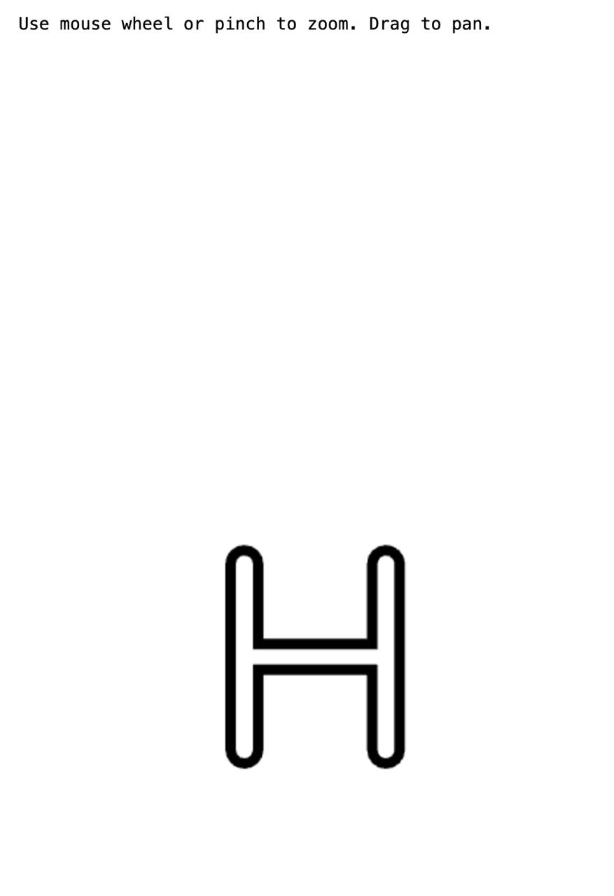
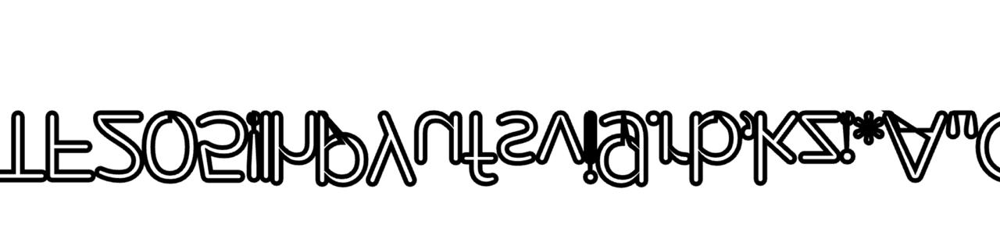
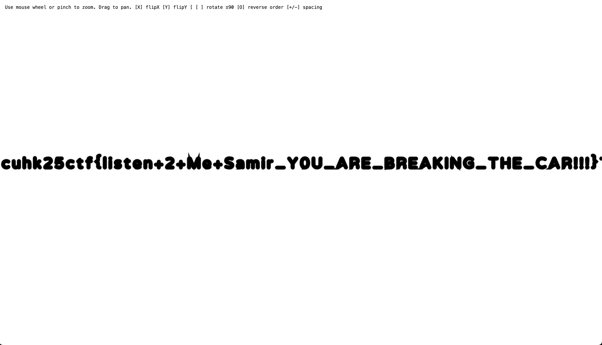

# Tuning Joyride - CTF write up
 
This write-up is written by Kim from team 0x5F3759DF.

## Foreword

Coming from a full-stack web development background, it was instinctive for me to begin digging through the files right away, especially given that this is a static website, with only a few source files.

Obviously, the CSS and HTML files are likely useless to us, so we jump straight into the one and only one JS file. It's minified, so we beautify it using [prettier](https://prettier.io/).

At this point, we see a huge object `t`, with properties `i` (serialized JSON string with 227k characters), `s` (serialized JSON string with 24k characters), and `h` (deserialized array with 40+ objects). 

227k characters... Not worth manually analyzing. So I decided to just do some data cleansing on my own, then I will pass all the files to our [cursor agent](https://cursor.com/) and see how far it will get us.

> The cursor agent will not be able to help us analyze the JS file right away, because of its limitations in reading large files. To tackle this, we manually crafted an `index-CZHshYmU-truncated.js`, basically a clone of the JS file, except we truncate the lengthy JSON strings by replacing a large portion of the elements in the middle with just `...`. 
> 
> Obviously, this means that the JS file will not interpret properly, but this will be sufficient for our Cursor agent to understand the structure of the code, deduce its behaviour, and begin its work recovering the flag.    

We can now start prompting the Cursor agent - and from here, the magic begins.

## Environment

- OS: 
    - Local: MacOS Sonoma 14.1 
- IDE: Cursor 1.5.11
    - Mode: Agent 
    - Model: gpt-5
    - Context: folder `~/Downloads/tuning_joyride`

## Process

At first, we prompted the agent in a very generic manner, simply asking it to try and solve for the CTF flag in format `cuhk25ctf{flag}`. As a result, the agent was analyzing the code mainly from an "ASCII cipher/ pattern" perspective.

While the agent is running, we also started the web server using [live preview](https://marketplace.visualstudio.com/items?itemName=ms-vscode.live-server). We quickly realized that the track is unnatural, and it seems to resemble some characters.

With this hypothesis in mind, we followed up with the agent, and prompted it to modify the source code such that the entire track is rendered at once. After prompting it again, we begin to see the full track from a bird-eye view. 

It visualized an "H" letter. From here, we know we were onto something. We screenshotted the track, and told our agent about this. It then began updating the renderer to render all glyphs instead of just one "H."

Now, we see something much more promising. The tracks were clearly ASCII characters, though they seem to be flipped. So we screenshotted the track again, and told our agent that the coordinate system might be wrong. It then began adding flip/ rotate controls to the renderer.

At this point, we can finally read the sentence. It begins with something like `HeloandwcmtCUKTF205`, which seemed to be an abbreviation or leet speak, so we continued reading, until the sentence started to become gibberish and indecipherable. 

We were confused, but then we quickly realized that all those characters were unique. It seems that our renderer is somehow rendering unique glyphs, instead of the actual glyph sequence. This also explains why the first sentence looked like an abbreviation - it was not intended by the author, but rather just our own mistake! With this in mind, we screenshotted the track again, and prompted our agent.

This time around, it finally revealed the full track, with a long essay that took us 3 minutes to read through. We also see the flag `cuhk25ctf{listen+2+Me+Samir_YOU_ARE_BREAKING_THE_CAR!!!}` now.

We submit the flag, and voila - wait, the flag was incorrect. 

We were super confused, but thought maybe the special characters were not rendered correctly - what if the underscores were actually dashes? We did some trial-and-errors with the different combinations, and it took us 18 tries before we finally figured it out. 

Apparently the flag had `Y0U` instead of `YOU` - I guess this is exactly why "Avoid Ambiguous Characters" is a thing [in password managers](https://www.reddit.com/r/1Password/comments/8q0ms9/avoid_ambiguous_characters/)... But anyway, with this, the flag mystery is finally solved.

## Chat snippets

The exported chat snippets are available in the `chat_snippets` folder.

## Source code

The `track.html` file is available in the `code` folder, along with the required JS source file `index-CZHshYmU.js` which has been beautified.